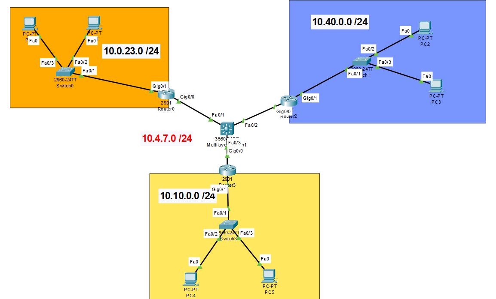

# Manual completo — Redistribución RIP, EIGRP y OSPF

## Topología general



### Tabla de direccionamiento completa

| Dispositivo | Interfaz | IP | Máscara | Red | Conectado a |
|---|---|---|---|---|---|
| RouterRIP | Gi0/0 | 10.4.7.1 | 255.255.255.252 | 10.4.7.0/30 | Switch Multilayer Fa0/1 |
| RouterRIP | Gi0/1 | 10.0.23.1 | 255.255.255.0 | 10.0.23.0/24 | Switch0 (LAN) |
| RouterEIGRP | Gi0/0 | 10.4.7.5 | 255.255.255.252 | 10.4.7.4/30 | Switch Multilayer Fa0/2 |
| RouterEIGRP | Gi0/1 | 10.40.0.1 | 255.255.255.0 | 10.40.0.0/24 | Switch1 (LAN) |
| RouterOSPF | Gi0/0 | 10.4.7.9 | 255.255.255.252 | 10.4.7.8/30 | Switch Multilayer Fa0/3 |
| RouterOSPF | Gi0/1 | 10.10.0.1 | 255.255.255.0 | 10.10.0.0/24 | Switch3 (LAN) |
| Switch ML | Fa0/1 | 10.4.7.2 | 255.255.255.252 | 10.4.7.0/30 | RouterRIP |
| Switch ML | Fa0/2 | 10.4.7.6 | 255.255.255.252 | 10.4.7.4/30 | RouterEIGRP |
| Switch ML | Fa0/3 | 10.4.7.10 | 255.255.255.252 | 10.4.7.8/30 | RouterOSPF |

### Default gateways de las PCs

| PC | Red | Default Gateway |
|---|---|---|
| PC0, PC1 | 10.0.23.0/24 | 10.0.23.1 |
| PC2, PC3 | 10.40.0.0/24 | 10.40.0.1 |
| PC4, PC5 | 10.10.0.0/24 | 10.10.0.1 |

---

## Orden de configuración recomendado

1. Configurar IPs en todas las interfaces
2. Verificar con `show ip interface brief`
3. Configurar protocolos de ruteo
4. Verificar adyacencias
5. Verificar tablas de ruteo con `show ip route`

> **Regla:** Siempre primero las IPs, luego los protocolos. Los protocolos buscan interfaces activas con IP al momento de configurarse — si no las encuentran, no levantan vecindad.

---

## RouterRIP

### Interfaces

```
Router> enable
Router# configure terminal

Router(config)# interface gigabitEthernet 0/0
Router(config-if)# ip address 10.4.7.1 255.255.255.252
Router(config-if)# no shutdown
Router(config-if)# exit

Router(config)# interface gigabitEthernet 0/1
Router(config-if)# ip address 10.0.23.1 255.255.255.0
Router(config-if)# no shutdown
Router(config-if)# exit
```

### Protocolo RIP v2

```
Router(config)# router rip
Router(config-router)# version 2
Router(config-router)# no auto-summary
Router(config-router)# network 10.4.7.0
Router(config-router)# network 10.0.23.0
Router(config-router)# exit

Router(config)# hostname routerRIP
routerRIP# write memory
```

### Verificación

```
routerRIP# show ip interface brief
routerRIP# show ip route
```

Resultado esperado en `show ip route` — entradas `R` son rutas aprendidas por RIP:

```
C    10.0.23.0/24  is directly connected, GigabitEthernet0/1
C    10.4.7.0/30   is directly connected, GigabitEthernet0/0
R    10.4.7.4/30   [120/1] via 10.4.7.2, GigabitEthernet0/0
R    10.4.7.8/30   [120/1] via 10.4.7.2, GigabitEthernet0/0
R    10.10.0.0/24  [120/5] via 10.4.7.2, GigabitEthernet0/0
R    10.40.0.0/24  [120/5] via 10.4.7.2, GigabitEthernet0/0
```

> `[120/1]` = distancia administrativa 120 (fija en RIP) / métrica 1 salto. Las rutas con métrica 5 son redes redistribuidas desde otros protocolos que llegaron con esa métrica asignada manualmente en el switch central.

---

## RouterEIGRP

### Interfaces

```
Router> enable
Router# configure terminal

Router(config)# interface gigabitEthernet 0/0
Router(config-if)# ip address 10.4.7.5 255.255.255.252
Router(config-if)# no shutdown
Router(config-if)# exit

Router(config)# interface gigabitEthernet 0/1
Router(config-if)# ip address 10.40.0.1 255.255.255.0
Router(config-if)# no shutdown
Router(config-if)# exit
```

> **Tip:** Puedes levantar ambas interfaces antes de asignar IPs:
> ```
> Router(config)# interface range gigabitEthernet 0/0-1
> Router(config-if-range)# no shutdown
> ```

### Protocolo EIGRP AS 100

```
Router(config)# router eigrp 100
Router(config-router)# no auto-summary
Router(config-router)# network 10.4.7.4 0.0.0.3
Router(config-router)# network 10.40.0.0 0.0.0.255
Router(config-router)# exit

Router(config)# hostname routerEIGRP
routerEIGRP# write memory
```

> EIGRP usa wildcard mask en el comando `network` — es el inverso de la máscara. Para /30 es `0.0.0.3`, para /24 es `0.0.0.255`.

> El número `100` es el AS (Autonomous System). Todos los dispositivos EIGRP de la misma topología deben usar el mismo AS para formar adyacencia.

### Verificación

```
routerEIGRP# show ip interface brief
routerEIGRP# show ip route
routerEIGRP# show ip eigrp neighbors
```

Cuando EIGRP levanta vecindad aparece automáticamente:

```
%DUAL-5-NBRCHANGE: IP-EIGRP 100: Neighbor 10.4.7.6 (GigabitEthernet0/0) is up: new adjacency
```

Resultado esperado en `show ip route`:

```
C    10.4.7.4/30    is directly connected, GigabitEthernet0/0
C    10.40.0.0/24   is directly connected, GigabitEthernet0/1
D    10.4.7.0/30    [90/...] via 10.4.7.6, GigabitEthernet0/0
D    10.4.7.8/30    [90/...] via 10.4.7.6, GigabitEthernet0/0
D EX 10.0.23.0/24  [170/...] via 10.4.7.6, GigabitEthernet0/0
D EX 10.10.0.0/24  [170/...] via 10.4.7.6, GigabitEthernet0/0
```

> `D` = ruta EIGRP interna (distancia admin 90). `D EX` = ruta redistribuida desde otro protocolo (distancia admin 170).

---

## RouterOSPF

### Interfaces

```
Router> enable
Router# configure terminal

Router(config)# interface gigabitEthernet 0/0
Router(config-if)# ip address 10.4.7.9 255.255.255.252
Router(config-if)# no shutdown
Router(config-if)# exit

Router(config)# interface gigabitEthernet 0/1
Router(config-if)# ip address 10.10.0.1 255.255.255.0
Router(config-if)# no shutdown
Router(config-if)# exit
```

### Protocolo OSPF proceso 1

```
Router(config)# router ospf 1
Router(config-router)# network 10.4.7.8 0.0.0.3 area 0
Router(config-router)# network 10.10.0.0 0.0.0.255 area 0
Router(config-router)# exit

Router(config)# hostname routerOSPF
routerOSPF# write memory
```

> El número `1` es el ID del proceso OSPF — es local al router y no necesita coincidir entre routers. Distinto al AS de EIGRP que sí debe coincidir.

> `area 0` es el área backbone, la principal en OSPF. En topologías simples todo va en área 0.

### Verificación

```
routerOSPF# show ip interface brief
routerOSPF# show ip route
routerOSPF# show ip ospf neighbor
```

Cuando OSPF establece vecindad completa aparece:

```
%OSPF-5-ADJCHG: Process 1, Nbr 10.4.7.10 on GigabitEthernet0/0 from LOADING to FULL
```

`FULL` confirma que la base de datos LSDB está completamente sincronizada con el vecino.

Resultado esperado en `show ip route`:

```
C    10.4.7.8/30    is directly connected, GigabitEthernet0/0
C    10.10.0.0/24   is directly connected, GigabitEthernet0/1
O    10.4.7.0/30    [110/2] via 10.4.7.10, GigabitEthernet0/0
O    10.4.7.4/30    [110/2] via 10.4.7.10, GigabitEthernet0/0
O E2 10.0.23.0/24  [110/20] via 10.4.7.10, GigabitEthernet0/0
O E2 10.40.0.0/24  [110/20] via 10.4.7.10, GigabitEthernet0/0
```

> `O` = ruta OSPF interna (distancia admin 110). `O E2` = ruta externa redistribuida tipo 2 — métrica no se incrementa en cada salto.

---

## Switch Multilayer — Redistribución central

Este es el dispositivo más importante de la topología. Es un switch capa 3 que corre los tres protocolos simultáneamente y redistribuye rutas entre ellos.

### Habilitar ruteo IP

En un switch capa 3 el ruteo no está activo por defecto:

```
Switch(config)# ip routing
```

> Sin este comando las interfaces tendrán IP pero el switch no reenviará paquetes entre redes — la redistribución no funcionará aunque esté configurada.

### Interfaces routed (no switchport)

El comando `no switchport` convierte el puerto de capa 2 a capa 3, permitiéndole tener IP propia:

```
Switch(config)# interface fastEthernet 0/1
Switch(config-if)# no switchport
Switch(config-if)# ip address 10.4.7.2 255.255.255.252
Switch(config-if)# duplex auto
Switch(config-if)# speed auto
Switch(config-if)# no shutdown
Switch(config-if)# exit

Switch(config)# interface fastEthernet 0/2
Switch(config-if)# no switchport
Switch(config-if)# ip address 10.4.7.6 255.255.255.252
Switch(config-if)# duplex auto
Switch(config-if)# speed auto
Switch(config-if)# no shutdown
Switch(config-if)# exit

Switch(config)# interface fastEthernet 0/3
Switch(config-if)# no switchport
Switch(config-if)# ip address 10.4.7.10 255.255.255.252
Switch(config-if)# duplex auto
Switch(config-if)# speed auto
Switch(config-if)# no shutdown
Switch(config-if)# exit
```

### RIP con redistribución

```
Switch(config)# router rip
Switch(config-router)# version 2
Switch(config-router)# no auto-summary
Switch(config-router)# network 10.0.0.0
Switch(config-router)# redistribute eigrp 100 metric 5
Switch(config-router)# redistribute ospf 1 metric 5
Switch(config-router)# exit
```

> `metric 5` asigna 5 saltos a las rutas externas. RIP tiene límite de 15 saltos — si la métrica fuera mayor, las rutas serían descartadas como inalcanzables.

### EIGRP con redistribución

```
Switch(config)# router eigrp 100
Switch(config-router)# no auto-summary
Switch(config-router)# network 10.4.7.4 0.0.0.3
Switch(config-router)# redistribute rip metric 10000 10 255 1 1500
Switch(config-router)# redistribute ospf 1 metric 10000 100 255 1 1500
Switch(config-router)# exit
```

EIGRP requiere 5 valores para la métrica al redistribuir:

| Posición | Parámetro | Valor usado | Descripción |
|---|---|---|---|
| 1 | Bandwidth | 10000 | Ancho de banda en Kbps |
| 2 | Delay | 10 / 100 | Retardo en microsegundos |
| 3 | Reliability | 255 | Confiabilidad (255 = 100%) |
| 4 | Load | 1 | Carga del enlace (1 = mínima) |
| 5 | MTU | 1500 | Tamaño máximo de paquete |

### OSPF con redistribución

```
Switch(config)# router ospf 1
Switch(config-router)# network 10.4.7.8 0.0.0.3 area 0
Switch(config-router)# redistribute rip subnets
Switch(config-router)# redistribute eigrp 100 subnets
Switch(config-router)# exit

Switch# write memory
```

> `subnets` es obligatorio en OSPF al redistribuir. Sin esta palabra clave OSPF solo redistribuye redes classful e ignora subredes — las rutas no aparecerían en los otros routers sin ningún mensaje de error visible.

### ¿Qué hace la redistribución?

Cada protocolo tiene su propio lenguaje de rutas. Sin redistribución cada zona es un mundo aislado.

```
RouterRIP aprende    10.0.23.0/24  →  redistribuye hacia EIGRP y OSPF
RouterEIGRP recibe   10.0.23.0/24  como D EX [170]
RouterOSPF recibe    10.0.23.0/24  como O E2  [110/20]

RouterEIGRP aprende  10.40.0.0/24  →  redistribuye hacia RIP y OSPF
RouterRIP recibe     10.40.0.0/24  como R     [120/5]
RouterOSPF recibe    10.40.0.0/24  como O E2  [110/20]

RouterOSPF aprende   10.10.0.0/24  →  redistribuye hacia RIP y EIGRP
RouterRIP recibe     10.10.0.0/24  como R     [120/5]
RouterEIGRP recibe   10.10.0.0/24  como D EX  [170]
```

Por eso hay 6 comandos `redistribute` en total — 2 por cada protocolo, uno por cada origen externo.

### Verificación completa del switch

```
Switch# show ip route
Switch# show ip eigrp neighbors
Switch# show ip ospf neighbor
Switch# show ip protocols
```

> `show ip protocols` es el más útil para verificar redistribución — muestra todos los protocolos activos, sus redes anunciadas y qué redistribuciones están configuradas en un solo output.

---

## Comparativa de los tres protocolos

| | RIP v2 | EIGRP | OSPF |
|---|---|---|---|
| Tipo | Distance Vector | Híbrido | Link State |
| Métrica | Saltos (máx 15) | Compuesta (BW, delay) | Costo (basado en BW) |
| Wildcard en network | No | Sí | Sí |
| Requiere área | No | No | Sí (area 0 mínimo) |
| Requiere AS | No | Sí (debe coincidir) | No (proceso es local) |
| Distancia admin | 120 | 90 interno / 170 externo | 110 |
| Mensaje de vecindad | Ninguno | DUAL-5-NBRCHANGE | OSPF-5-ADJCHG |
| Código en tabla | R | D / D EX | O / O E2 |
| Redistribución métrica | Saltos simples | 5 valores obligatorios | subnets obligatorio |

---